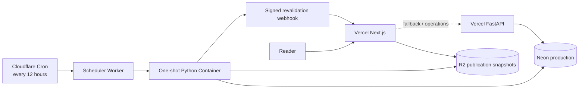

# Production deployment

Open Signal's beta runtime uses services already covered by the project's paid
plans: Vercel for the public web and read-only API, Cloudflare Workers +
Containers for scheduled batch work, R2 for public publication snapshots, and
Neon for the system of record.



The database remains authoritative. R2 is a read-optimized publication layer,
not a second mutable source of truth. Each Edition and its Claim payloads are
written under immutable Edition keys. Current Claim, Topic, Explore, edition
archive, and SEO-index projections are refreshed, and the front-page pointer
moves last. Vercel is notified only after that move. Public pages read R2
first; the FastAPI service is the long-tail and operations fallback.

## Provisioned beta resources

| Surface | Resource |
|---|---|
| Web | `https://os.yhleo.com` (`open-signal-web.vercel.app` fallback) |
| Read-only API | `https://open-signal-api.vercel.app` |
| R2 bucket | `open-signal-publications` (APAC) |
| R2 beta read origin | `https://pub-663344cb96044648a00527ba459d1a03.r2.dev` |
| Batch | Cloudflare Worker `open-signal-scheduler`, twelve-hour Cron |
| Database | Neon project `open-signal`, `production` branch |
| Destructive tests | Neon `test` branch only; see `docs/TESTING.md` |

The `r2.dev` address is suitable for the beta bring-up. Before a wider public
launch, attach a custom domain to the R2 bucket so the read origin has normal
production controls and rate limits.

## Runtime configuration

Never commit these values. Keep each secret only at the service that consumes
it.

### Vercel API project

| Variable | Scope |
|---|---|
| `OPEN_SIGNAL_DATABASE_URL` | Production; Sensitive |
| `OPEN_SIGNAL_OPS_TOKEN` | Production; Sensitive |

The Python function keeps one pooled connection with one overflow connection
per warm instance. This bounds connection fan-out while retaining connection
reuse.

### Vercel web project

| Variable | Scope |
|---|---|
| `OPEN_SIGNAL_PUBLICATION_BASE_URL` | Production + Preview |
| `OPEN_SIGNAL_API_URL` | Production + Preview fallback |
| `OPEN_SIGNAL_REVALIDATE_TOKEN` | Production; Sensitive |

The browser calls same-origin Route Handlers. R2 and API origins remain
server-side configuration, which preserves the option to change providers or
add locales without rebuilding client code.

### Cloudflare Worker runtime

| Secret | Purpose |
|---|---|
| `OPEN_SIGNAL_DATABASE_URL` | Neon production connection |
| `DEEPSEEK_API_KEY` | Charter Agent calls and publication-time localization |
| `OPEN_SIGNAL_R2_ENDPOINT_URL` | Account-scoped R2 S3 endpoint |
| `OPEN_SIGNAL_R2_ACCESS_KEY_ID` | Bucket-scoped Object Read & Write key |
| `OPEN_SIGNAL_R2_SECRET_ACCESS_KEY` | Bucket-scoped secret |
| `OPEN_SIGNAL_R2_PUBLIC_BUCKET` | `open-signal-publications` |
| `OPEN_SIGNAL_REVALIDATE_URL` | Web `/api/revalidate` URL |
| `OPEN_SIGNAL_REVALIDATE_TOKEN` | Must match Vercel web |

The R2 key should be restricted to Object Read & Write on
`open-signal-publications`; it does not need account-wide bucket-management
permission.

### GitHub deployment secrets

| Secret | Purpose |
|---|---|
| `CLOUDFLARE_ACCOUNT_ID` | Target account for Wrangler |
| `CLOUDFLARE_API_TOKEN` | Account-scoped Worker/Container deployment token |

These two values authorize CI deployment only. They are separate from the
runtime R2 credentials above.

## Scheduling and inactivity

The reference deployment uses two batches per day (00:00 and 12:00 UTC;
08:00 and 20:00 in Singapore). This reduces main-pipeline starts by two thirds
compared with the previous four-hour cadence. It is intended to lower database
compute consumption; it is not a guarantee of 2–3 CU-hours per day. Batch
duration, autoscaling, other database clients, and daily research work also
affect usage. Compare several complete days of actual consumption after a
cadence change. Do not add health-check polling that wakes the database.

The reference deployment invokes the scheduler at `0 */12 * * *` (UTC). The
platform occurrence time is passed into the Python command, which gives every
registry schedule a stable idempotency bucket even after a delayed or duplicate
invocation.

The one-shot process drains queues in dependency order and exits. The Container
has a 55-minute inactivity ceiling only as protection against a hung batch; a
normal completed process stops earlier. The authoritative registry retains the
different editorial cadences:

| Work | Cadence |
|---|---:|
| Expectations / Polymarket | every 12 hours |
| Rules / Federal Register | every 12 hours |
| ClinicalTrials | daily |
| Research / OpenAlex | daily |
| Freshness retirement check | every 12 hours |
| English snapshot delivery | every 12 hours |
| Raw-payload TTL purge | every 12 hours, at most 1,000 rows |

There are two independent scheduling layers. The Wrangler Cron is the outer
wake-up ceiling; `infra/registries/job-schedule-registry.yaml` is the
authoritative per-job cadence. The scheduler evaluates only the current bucket
and does not replay every platform occurrence that was skipped. Consequently,
a 12-hour outer Cron also makes nominal four-hour jobs run at most every 12
hours.

For a self-hosted installation, edit both layers when changing the intended
cadence:

| Profile | `triggers.crons` | Matching shortest `cadence_seconds` |
|---|---|---:|
| Hourly | `0 * * * *` | `3600` |
| Every 4 hours | `0 */4 * * *` | `14400` |
| Every 12 hours (reference default) | `0 */12 * * *` | `43200` |
| Daily | `0 0 * * *` | `86400` |

Keep slower source-specific jobs at their existing cadence unless you
intentionally want to change them. Lower frequency reduces Container starts,
Neon wake-ups, source requests and agent opportunities, at the cost of an equal
increase in worst-case discovery and publication delay. Evidence thresholds,
freshness timestamps and immutable Edition semantics do not change.

No schedule manufactures content. A Section keeps its last verified output
until new verified meaning arrives or the freshness policy ages/demotes/retires
it. A retirement triggers a full-page compile, so the reader still sees a
complete, intentionally composed page.

Both Neon branches are configured to suspend compute after five minutes without
database activity. The `test` branch is never used by an application runtime;
the guarded test launcher is the only supported destructive-test entry point.

## Deploy

1. Apply Alembic migrations to Neon production before code that depends on
   them.
2. Merge a green change to `main`. Vercel's Git integrations deploy the API and
   web projects.
3. `.github/workflows/deploy-cloudflare.yml` builds the Linux container on the
   GitHub runner and deploys the Worker through Wrangler.
4. Wait for the Container image to become ready on first deployment.
5. Run the checks below.

Manual Cloudflare deployment is also possible from a machine with Docker
running:

```powershell
npm --prefix infra/cloudflare ci
npm --prefix infra/cloudflare run deploy
```

## Production checks

```powershell
Invoke-RestMethod https://open-signal-api.vercel.app/health

Invoke-RestMethod https://open-signal-web.vercel.app/api/publication/current

$token = [Environment]::GetEnvironmentVariable(
  "OPEN_SIGNAL_OPS_TOKEN",
  "User"
)
Invoke-RestMethod `
  -Uri https://open-signal-api.vercel.app/api/ops/current-edition `
  -Headers @{ Authorization = ("Bearer " + $token) }
```

After the first scheduled delivery, verify that both R2 current pointers exist:

- `public/publications/channels/front-page/en.json`
- `public/publications/channels/explore/en.json`
- `public/publications/channels/editions/en.json`
- `public/publications/channels/seo-index.json`

The front-page pointer and English web snapshot must reference the same Edition
ID as the operations endpoint.

## Rollback

- Roll Vercel web or API back to a known deployment independently.
- Roll the Cloudflare Worker back to a prior version; do not delete its image
  while that version may still be needed.
- Never overwrite an archived Edition to simulate rollback. Use the Edition
  Writer rollback/correction path so PostgreSQL, the Claim Ledger, R2 and the
  public pointer retain an auditable transition.
- If snapshot delivery fails, the last complete R2 pointer remains public and
  the failed Job is retried. The API fallback remains available.

